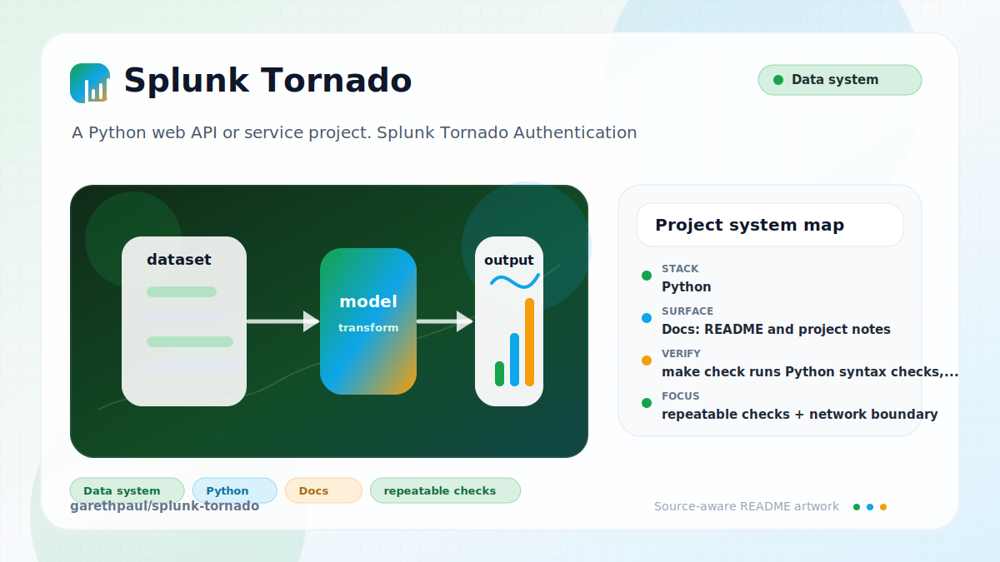

# splunk-tornado

<!-- README-OVERVIEW-IMAGE -->


## Overview

`garethpaul/splunk-tornado` is a Python web API or service project. Splunk Tornado Authentication

This README is based on the checked-in source, manifests, scripts, and repository metadata on the `master` branch. The project language mix found during review was: Python (5).

## Repository Contents

- `README`
- `CHANGES.md` - maintenance history for auth compatibility checks
- `Makefile` - local verification entry points
- `docs/plans` - completed maintenance plans for the current baseline
- `plans` - historical implementation notes
- `requirements.txt` - runtime dependency notes
- `scripts` - documentation-plan validators
- `SECURITY.md` - security reporting and disclosure guidance
- `setup.py` - Python dependency or packaging metadata
- `splunktornado` - source or example code
- `VISION.md` - project direction and maintenance guardrails

Additional scan context:

- Source directories: splunktornado
- Dependency and build manifests: setup.py
- Entry points or build surfaces: none detected
- Test-looking files: tests/test_auth.py, splunktornado/test/__init__.py, splunktornado/test/noauth.py

## Getting Started

### Prerequisites

- Git
- Python 3 for local verification

### Setup

```bash
git clone https://github.com/garethpaul/splunk-tornado.git
cd splunk-tornado
python3 -m pip install -r requirements.txt
```

The setup commands above are derived from repository files. Legacy mobile, Python, or JavaScript samples may require older SDKs or package versions than a modern workstation uses by default.

## Running or Using the Project

- No single runtime entry point was identified. Start by reading the source files and manifests listed above.

## Testing and Verification

- `make check` runs Python syntax checks, unit tests, and `setup.py check`.
- The tests mock response objects and Tornado HTTP clients; they do not require
  a live Splunk instance.
- `make check` also requires completed canonical plans under `docs/plans`.

When the required SDK or runtime is unavailable, use static checks and source review first, then verify on a machine that has the matching platform toolchain.

## Configuration and Secrets

- No required secret or credential file was identified in the repository scan. If you add integrations later, keep secrets out of git.

## Security and Privacy Notes

- Review changes touching authentication or token handling; examples from the scan include splunktornado/__init__.py, splunktornado/auth.py.
- Review changes touching network requests, sockets, or service endpoints; examples from the scan include setup.py, splunktornado/__init__.py, splunktornado/auth.py, splunktornado/test/noauth.py.
- Review changes touching file, media, JSON, XML, CSV, OCR, or data parsing; examples from the scan include splunktornado/auth.py.

## Maintenance Notes

- See `SECURITY.md` for vulnerability reporting and safe research guidance.
- See `VISION.md` for project direction and contribution guardrails.
- See `docs/plans/2026-06-08-splunk-tornado-baseline.md` for the canonical
  auth and request compatibility baseline.

## Contributing

Keep changes small and tied to the project that is already present in this repository. For code changes, document the toolchain used, avoid committing generated dependency directories or local configuration, and update this README when setup or verification steps change.
